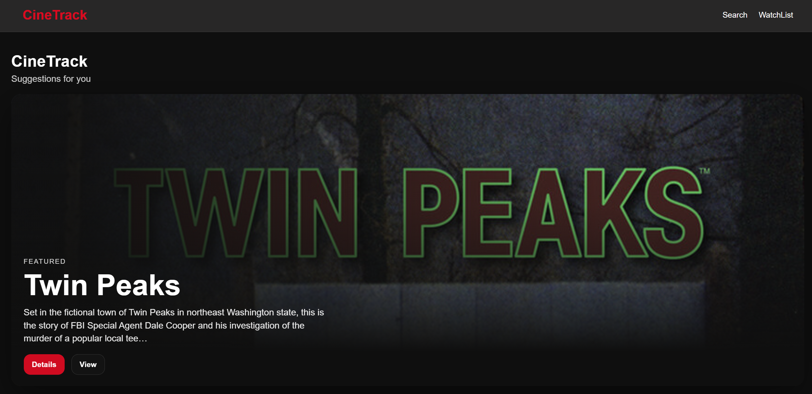
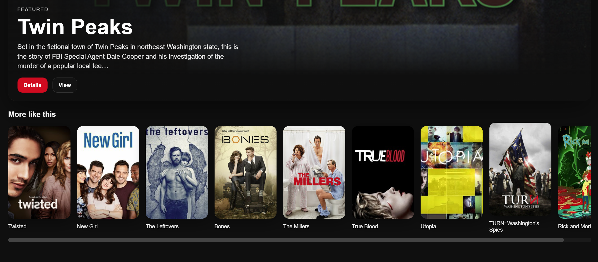
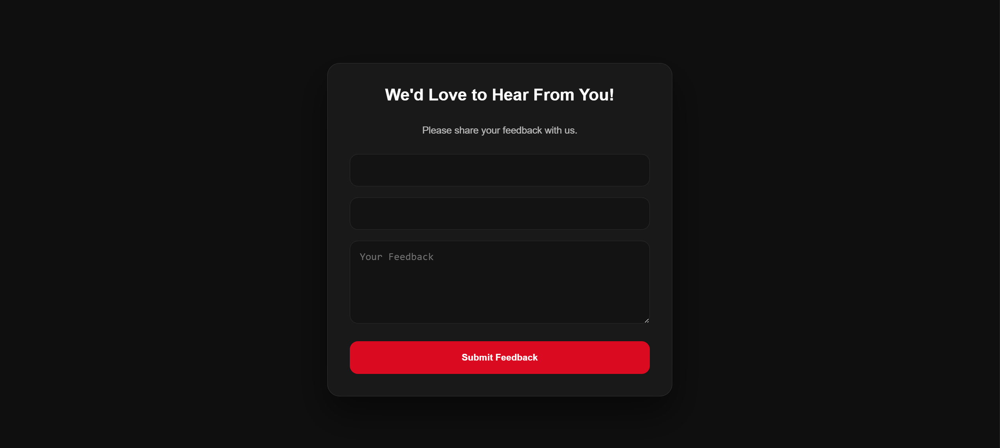
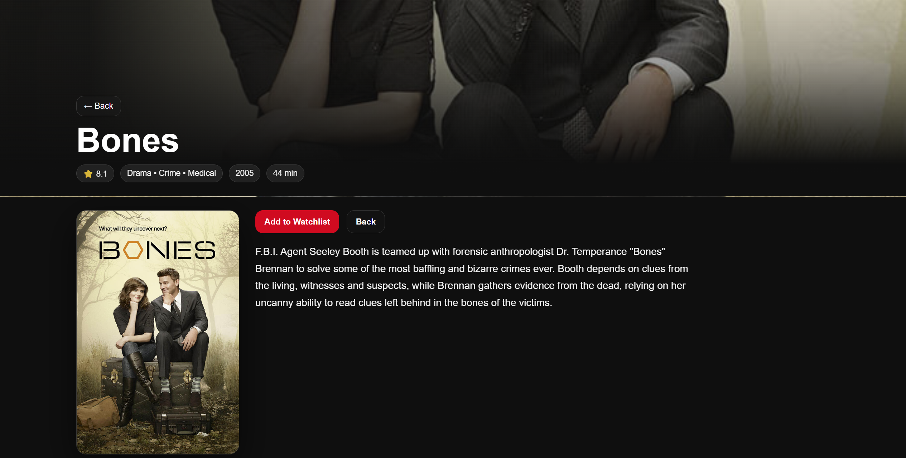
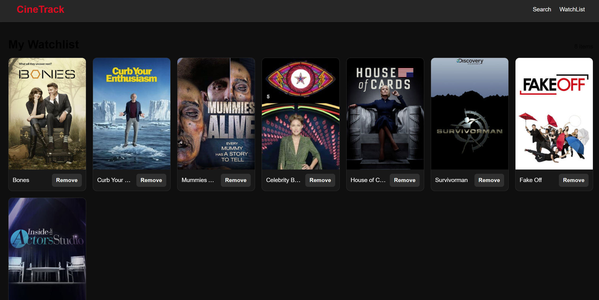

# CineTrack 🎬

CineTrack is a modern movie and TV discovery web application built with React.  
It features a clean, Netflix-inspired UI where users can explore shows, view detailed information, and manage a personal watchlist.

The app focuses on dynamic content, smooth navigation, and a visually engaging user experience.

---

## 🏠 Home Page

### 🎬 Hero Section


A dynamic hero banner featuring a randomly selected TV show with a bold, cinematic design. The banner displays the show title, genres, and rating prominently against a dark background with the show's poster art. A vibrant call-to-action button invites users to explore or add the show to their watchlist. The Netflix-inspired layout creates an engaging first impression with smooth transitions and responsive spacing.

The homepage opens with a dynamic hero banner that highlights a randomly selected show.  
Each refresh presents a different featured title, making the experience feel fresh and alive.  
The layout is inspired by streaming platforms, combining strong visuals with clear call-to-action buttons.

---

### ➡️ Scrollable Suggestions


Horizontal scrollable row of TV show cards displaying cover artwork, titles, and ratings. Each card features a show poster on the left with the show title and star rating prominently displayed. The cards are arranged in a continuous row with smooth scrolling functionality, allowing users to browse through multiple shows without page navigation. The dark theme background creates contrast with the colorful show artwork, and subtle hover effects enhance interactivity.

Below the hero section, shows are displayed in horizontal scrollable rows.  
This allows users to quickly browse content in an intuitive way using smooth scrolling behavior.  
The suggestions are randomly selected from the API, ensuring variety every time the page loads.

---

### 💬 Feedback Form


A dark-themed feedback form with input fields for user name, email, and message. The form features a clean layout with labeled text inputs and a submit button styled to match the application's Netflix-inspired design. The form maintains responsive spacing and includes subtle hover effects to enhance interactivity. Text inputs have a contrasting border color for visibility against the dark background, and the submit button uses the app's accent color to draw user attention.

A styled feedback form allows users to submit their thoughts.  
It follows the same dark theme as the rest of the app, with responsive inputs and interactive UI elements.

---

## 🔍 Search Page

The search page allows users to look for TV shows in real time.  
As the user types, the app sends requests to the TVMaze API and dynamically updates the results.

The layout is built using a responsive grid, ensuring that results adapt smoothly to different screen sizes.

---

## 🎥 Show Details Page


A dark-themed show details page displaying comprehensive information about a selected TV show. The page features the show poster on the left side with the title, genres, rating, and a detailed summary prominently displayed on the right. A prominent call-to-action button allows users to add the show to their watchlist. Additional metadata such as network, status, and episode information is organized in a clean, readable layout against the dark background. The design maintains consistency with the Netflix-inspired aesthetic throughout the application, with clear typography and organized sections that guide the user through the show information in a logical flow.

Each show has a dedicated details page accessible through dynamic routing.  
This page displays extended information such as title, genres, rating, and summary.

Users can also add shows to their watchlist directly from this page.

---

## ⭐ Watchlist Page


A dark-themed watchlist page displaying a collection of saved TV shows in a grid layout. Each show card features a poster thumbnail on the left with the show title, genres, and rating positioned on the right. A remove button is prominently displayed on each card, allowing users to delete shows from their watchlist. The page header indicates the total number of saved shows. The layout is responsive and maintains the Netflix-inspired dark aesthetic with consistent typography and spacing. The mood is clean and organized, providing users with an intuitive interface to manage their saved content.

The watchlist page allows users to save and manage their favorite shows.  
All data is stored in the browser using localStorage, so the list persists even after refreshing the page.

Users can easily remove items or navigate back to the show details.

---

## 🚀 Tech Stack

- React 
- React Router DOM
- Axios
- TVMaze API
- CSS (Responsive + Media Queries)

---

## 🧠 Concepts & Techniques Used

This project focuses on core frontend development concepts:

### State Management
- `useState` is used to manage UI data such as search results, suggestions, and watchlist items.
- The UI updates automatically when the state changes.

### Side Effects
- `useEffect` is used to fetch data from the API when components load.
- It ensures data is loaded at the right time without unnecessary re-renders.

### API Integration
- Axios is used to send asynchronous requests to the TVMaze API.
- Data is fetched, processed, and displayed dynamically.

### Dynamic Routing
- React Router is used to navigate between pages.
- Routes like `/show/:id` allow dynamic loading of show details.

### Conditional Rendering
- Components render different UI based on conditions (e.g., empty watchlist vs populated list).

### Local Storage
- The watchlist is stored using `localStorage`, allowing persistence across sessions.

### Responsive Design
- Media queries are used to adapt layouts for different screen sizes.
- Font sizes, spacing, and grid behavior adjust for mobile devices.

### UI/UX Design
- Dark theme inspired by Netflix
- Smooth hover effects and transitions
- Horizontal scrolling for better browsing experience

---

## ⚙️ How It Works

1. The app fetches data from the TVMaze API  
2. Results are stored in React state  
3. Components re-render automatically  
4. Navigation is handled via React Router  
5. Watchlist data is saved locally in the browser  

---

## 📦 Installation

```bash
git clone https://github.com/yourusername/cinetrack.git
cd cinetrack
npm install
npm run dev